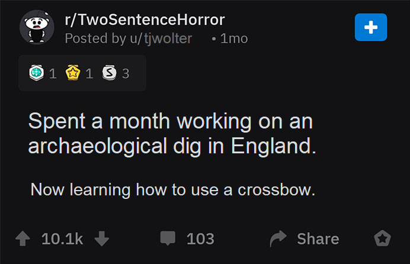

# Ideas

## Knowledge Base

I think this [LYNK Library of Knowledge](https://docs.lynkrobotics.org/programming/index.html) is a good example of what we can setup.

## Training

### Cheif Delphi Threads

I scoured Cheif Delphi and found a few good threads that make some good points and are worth scanning. 

- [Looking for Basic Java WPI Robot Code Guides](https://www.chiefdelphi.com/t/looking-for-basic-java-wpi-robot-code-guides/505962/4)
- [How to make programming (Java) training interesting for rookies?](https://www.chiefdelphi.com/t/how-to-make-programming-java-training-interesting-for-rookies/412299)
- [Favorite free Java-for-beginners training?](https://www.chiefdelphi.com/t/favorite-free-java-for-beginners-training/442524/9)
- [How do you teach programming members quickly?](https://www.chiefdelphi.com/t/how-do-you-teach-programming-members-quickly/466580)

> The code is a means to an end. No one’s gonna be super excited about learning language syntax and semantics.

---

> Like, as much as you can, have the students writing software for a real robot that moves around and looks and feels as much like an FRC robot as possible.

---

> The best piece of advice I’ve been given for when I’ll teach the kids next year is “people love instant rewards”. If you start off with the absolute basics of, e.g., running a motor, rather than going through all the subsystem and command junk right off the bat, you’ll get a reward quickly, encouraging them to keep going.

---

4 Common Rules of Robotics

1. Imitate the Best, Invent the Rest
2. It's probably been done before
3. KISS - Keep it Sane and Simple
4. If it ain't broke, don't fix it (this saying is not meant to be a blanket rule against progress; it specifically warns against "changing" something that is already functional without a clear benefit, not against innovation in areas that are truly broken or inefficient)

---

### Romi

I have seen Romi mentioned a number of times and I think it looks like a good simple options for new programmers to play with. It appears it uses WPILib and the Driver Station so it will ideally keep everything within the same context. 

I think ROMI could be a good way to get familiar with the First infrastructure and how to make a simple robot do things with JAVA and the WPI Lib tools. 

- [WPI Lib Getting Started with Romi](https://docs.wpilib.org/en/stable/docs/romi-robot/index.html)
- [RomiTutorial2023](https://github.com/DevilBotz2876/RomiTutorial2023) this looks like a decent example project that can be used for examples too. Shows how they use it for all the things up to and including paht planning and vision. 

### Youtube Videos

There are hundreds, if not thousands, of good channels and videos on Youtube that help ramp up for FIRST and Java. We should consider getting a youtube account setup if we dont have one already so we can create training and knowledge base playlists. 

I started creating a playlist here to start as example, some of these are videos that are meant as an example and should click on their channel link as they have other good resources. I will continue to add to this as I find good examples. 

https://www.youtube.com/playlist?list=PLoJ0Fk538yWUsBmjTRQJaDXsh9MKWiHFO

Mathew made a very good point that while [FIRSTinMichigan](https://www.youtube.com/@FIRSTinMichigan) has some excellent recent content for FRC platform, they are long. There are many examples from other first teams that keep every video to no more than 15 minutes, even if they have to broken into chunks, these could be what we look for.  

### Other teams github projects and training projects.

- [Highlanders-Training](https://github.com/HighlanderRobotics/Highlanders-Training) this is a good one. NOTE: its not the same Highlander as here in CO. 

- [Phoenix6-Examples](https://github.com/CrossTheRoadElec/Phoenix6-Examples)

## IDE

### Use intelliJ along with VS Code

> This is meant more for the senior Devs. 

While Visual Studio is the IDE of choice for FIRST and WPI, its not the only thing that can be used. I dont recommend ditching VS Code, simple augment with other IDEs when it makes sense and bounce between them. I am writing this markdown doc in VS Code becuase its a better editor for that. But Intelij IDEA is vastly better when I am writing Java. 

Also see this article ["Why VSCode Can’t Beat IntelliJ for Serious Java Developers (And Probably Never Will)"](https://medium.com/javarevisited/why-vscode-cant-beat-intellij-for-serious-java-developers-and-probably-never-will-98b8d062ebfb)

### Online IDE for training and examples. 

there are many online "instant" IDEs but they usually dont have intellisense for java. These do. 

- [CoderChef](https://www.codechef.com/)
- [CoderPad](https://coderpad.io/languages/java/)

## Git and Github

- [Git Version Control Introduction](https://docs.wpilib.org/en/stable/docs/software/basic-programming/git-getting-started.html#)

- Take avantage of a [good Git workflow](https://github.com/HighlanderRobotics/Highlanders-Training/blob/main/Docs/1_General/1.3_GitWorkflow.md).  Use PRs and common branch names. 

- Github supports Markdown natively. Its a simple an powerful way to create docs and communicate. This is written in Markdown. 

- Github also has a very robust but also simple issue and project managment solution built into each project. We should be taking advantage of it to organize work and communicate issues.

- Keep it clean, its looks like we have some duplicate projects or there was confusions with naming during checkin for kid bot. 

## Rapid Prototypes and POC

We should keep a functioning robot, recent kidbot, that can be used and ideally dedicated to programming. It can serve as platform for new developers to experiment but also primarly serve as baseline for getting core fundamentals worked out before and while the main bot is being built. 

## 2027 and Future

### Systemcore, RoboRIO Replacement

- In June First [announced the new Systemcore](https://community.firstinspires.org/systemcore-alpha-testing-first-wave)
  
- The new WPI Lib Docs are here with the RoboRio replacment called [Systemcore](https://docs.wpilib.org/en/2027/docs/software/systemcore-info/systemcore-introduction.html) with the [link to the specs](https://downloads.limelightvision.io/documents/systemcore_specifications_june15_2025_alpha.pdf). 

- In October 2025, First posted that we can [apply to be Alpha/Beta testers](https://community.firstinspires.org/2025-control-system-testing-reminder-for-2027). We should consider it. 

### Python

Its not ready yet but we should keep an eye on it. 

## References

